# YUMMY TUMMY

## Overview

Yummy Tummy is a delightful recipe suggestion application built with Django and styled using Bootstrap 5. It is my final project for Code Institute's 16-weeks Full Stack Development Bootcamp course. It offers a seamless user experience with full CRUD functionality, allowing users to effortlessly create, read, update, and delete their comments. 
This project aims to provide a centralized, user-friendly platform for food enthusiasts to discover and manage recipes, enhancing culinary exploration and enjoyment.

We addresses the challenge of meal planning by offering users the option to categorize recipes by meal type (breakfast, lunch, dinner). This feature helps users to relax and plan their meals accordingly, ensuring a well-organized and enjoyable cooking experience.

[Live View](https://yummy-tummy-582bc957dc87.herokuapp.com/)

## Responsive
Yummy Tummy is fully responsive, ensuring a seamless experience across various devices, including desktops, tablets, and mobile phones. 
The design adapts to different screen sizes, providing an optimal viewing experience whether you're at home or on the go.

## User Expereince (UX)

Throughout the development of Yummy Tummy, **Agile methodology** was employed to ensure iterative progress and continuous improvement. 
This approach facilitated regular feedback and allowed for adaptive planning, ultimately leading to a more refined and user-centric application.

### User Goals

Users want a platform that:
- Provides a wide variety of recipes to explore.
- Allows easy categorization and search of recipes by meal types
- Includes user reviews and ratings to help in selecting recipes.
- Easy navigation

### Site Owner Goals

The site owner aims to:
- Create a comprehensive and user-friendly recipe management platform.
- Encourage user engagement through interactive features like comments and ratings.
- Continuously update the recipe database with new and diverse recipes.
- Foster a community of food enthusiasts who can collaborate by sharing new recipes.
- Maintain a high standard of UX/UI design to enhance user satisfaction.

### Link to User Stories in GitHub Projects:

I have used the MoSCoW technique to prioritize and complete my project requirements effectively. This technique helped me to categorize the features into Must-Have, Should-Have, and Could-Have, ensuring that the most critical functionalities were implemented first, while also considering additional enhancements for future development.

Here is the link to my [Project Board](https://github.com/users/SonaliP11/projects/8)

#### MoSCoW Technique
The MoSCoW technique is a prioritization method used to decide which features to implement in a project. It stands for:

- **Must-Have**: These are the essential features that the project cannot do without. They are critical for the application's functionality and must be included in the initial release.
- **Should-Have**: These features are important but not critical. They add significant value to the project and should be included if possible, but the project can still function without them.
- **Could-Have**: These are desirable features that can enhance the user experience but are not essential. They can be considered for future updates if time and resources permit.
- **Won't-Have**: These features are the least critical and will not be included in the current project scope. They may be revisited in future iterations.

By using the MoSCoW technique, I was able to focus on delivering the most critical features first, ensuring a functional and valuable application for users while planning for future enhancements.
I have implemented all Must-have and Should-have features. Could-have are for future implementations.

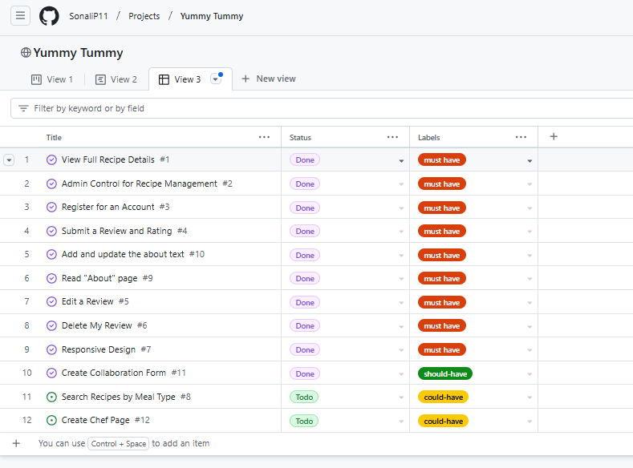

## Design

### Wireframes

The wireframes for Yummy Tummy were created using Balsamiq to create clear, visual layouts of the site's design. While the initial designs provided a solid foundation, some elements evolved during development to enhance the overall user experience. These changes, though different from the original wireframes, resulted in a more polished and user-friendly application.

- [Click here for desktop wireframe](static/images/readme/wireframe-desktop.png)
- [Click here for tablet wireframe](static/images/readme/wireframe-tablet.png)
- [Click here for mobile wireframe](static/images/readme/wireframe-mobile.png)

### Logo
The logo for Yummy Tummy was created by me, reflecting the essence of the application. Here are some key points about the logo:

- **Design Concept**: The logo combines elements of cutlery to visually represent the application's focus on recipes and cooking.
- **Color Scheme**: The colors used in the logo align with the overall color palette of the application, ensuring a cohesive visual identity.
- **Typography**: The font used in the logo is clean and modern, making it easily readable and visually appealing.
- **Scalability**: The logo is designed to be scalable, ensuring it looks great on various devices and screen sizes, from mobile phones to desktops.

- [logo](static/images/readme/logo.jpeg)

### Color Palette
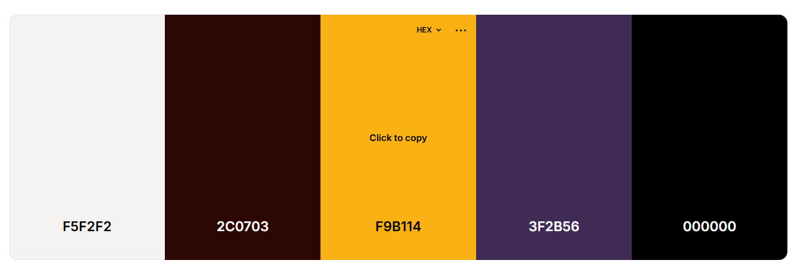

- #3F2B56 - Navigation and footer background
- #F9B114 - Background of Buttons and card-title
- #2C0703 - Heading text and box-shadow
- #F5F2F2 - Forms background
- #000000 - Text color

### Typography 

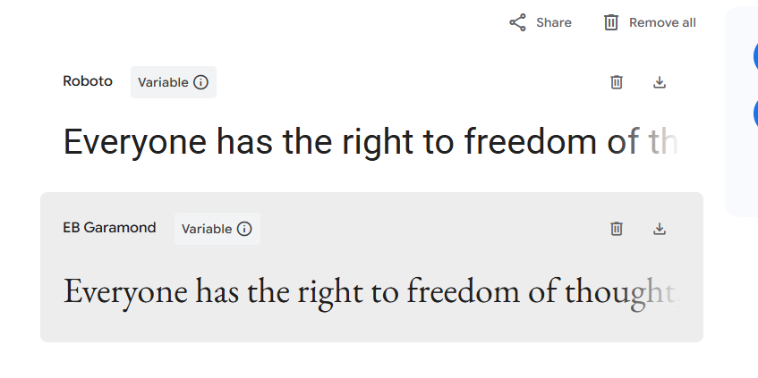
 - Heading - 'EB Garamond', serif
 - Body - 'Roboto', serif

## Features

### Authentication

- **Sign-In**: Users can sign in to their accounts to access personalized features such as adding ratings and reviews.
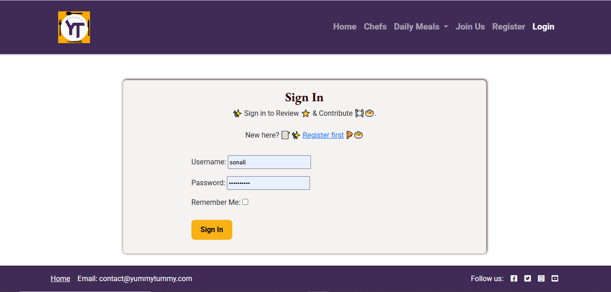

- **Sign-In Success** : Once log-in, user will see success message.
 

- **Register**: New users can register for an account to start collaborating and sharing their recipes.
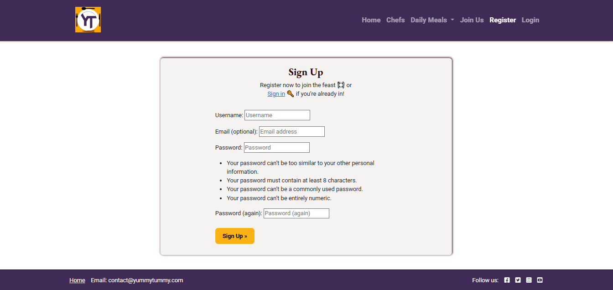

- **Sign-out** : In the header, if you are logged in, you can press the 'Logout' button which will take you to the sign-out page.
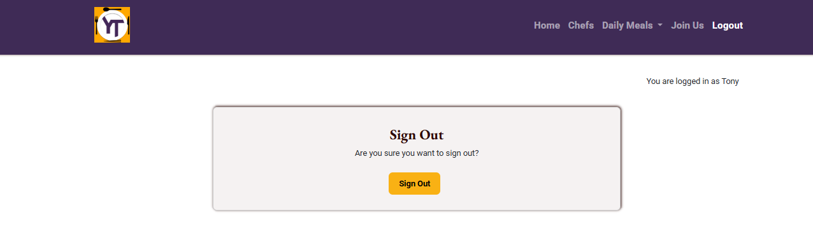 

- **Sign-out success** : User will see sign-out message.
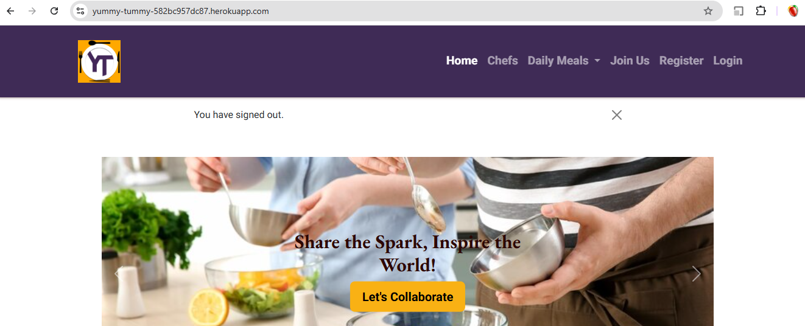

### Collaboration

- **Share Recipes** : Users can share their own recipes with the community, fostering a collaborative environment. 
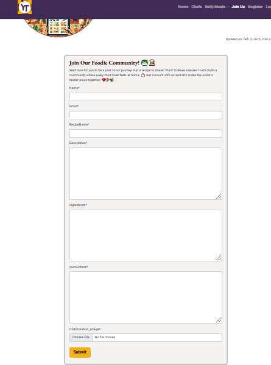

- **Recipe submitted** : Once, you submit recipe, there will be a pop-up message which acknowledge the submission.
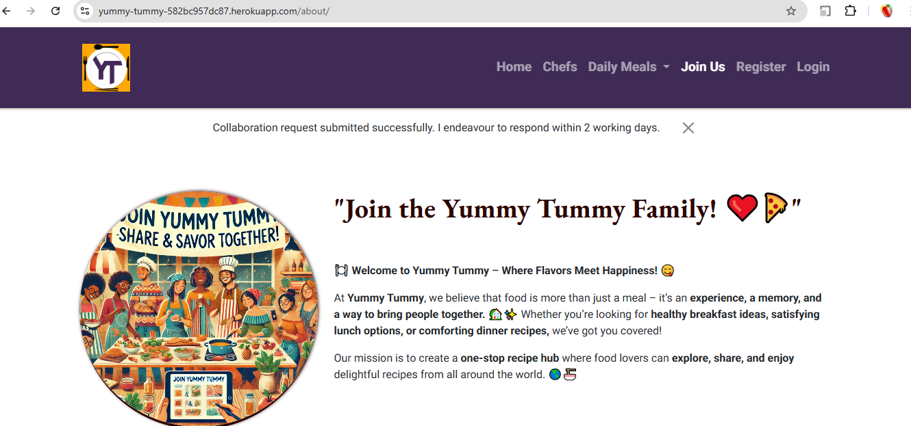

- **Write Reviews**: Users can write reviews and rate recipes, helping others to choose the best recipes.
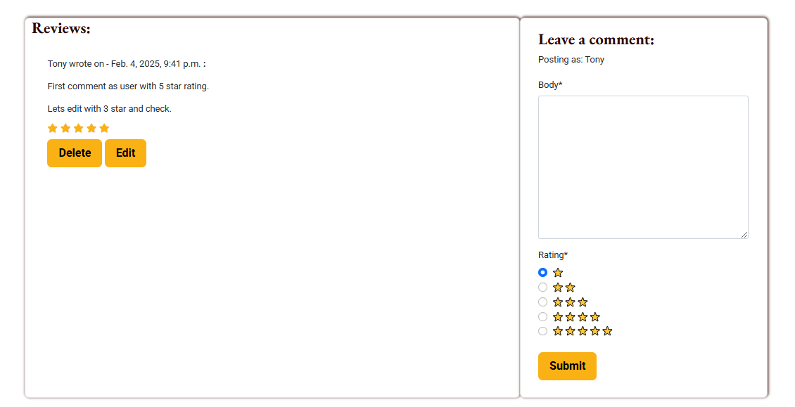

- **Awaiting approval**: Users will receive apporoval awaiting text after editing their own comment.
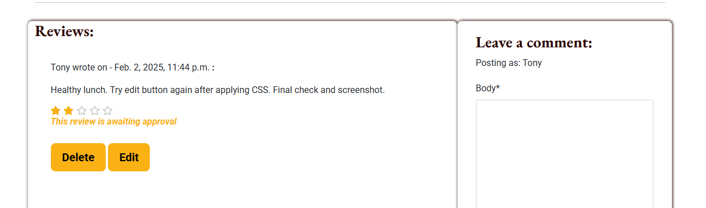

- **Comment Approved**: Admin will approve comment from dashboard.
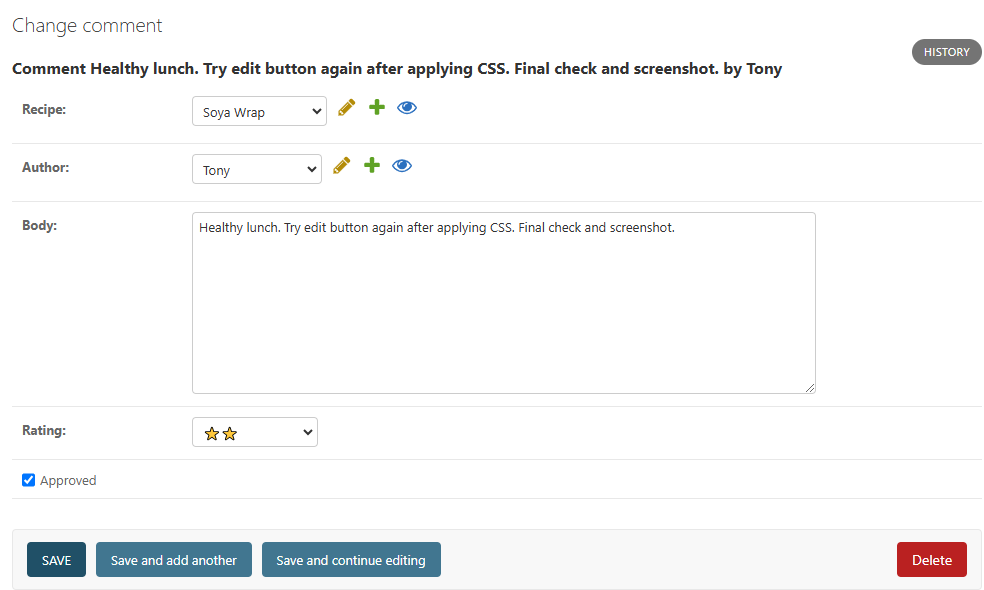

- **Comment Updated**: Users will be able to see their comments updated.
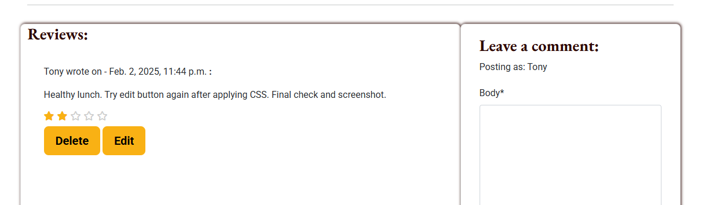

- **Delete Confirmation**: If a user wants to delets his comment, he can but a confirm message will pop up to ask him again to be sure.
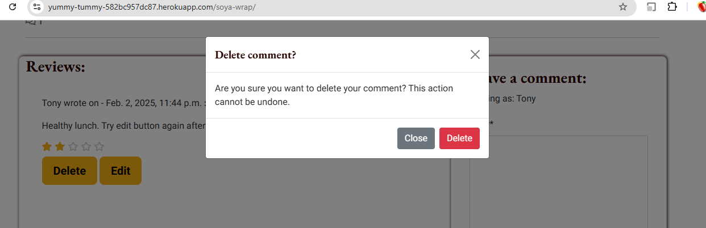

- **Comment Deleted** : User will see commment deleted pop up.

### Admin panel Database

The database for Yummy Tummy is designed to efficiently manage and store user data, recipes, comments, and ratings. It uses PostgreSQL, a powerful, open-source relational database system, which ensures data integrity and supports complex queries.

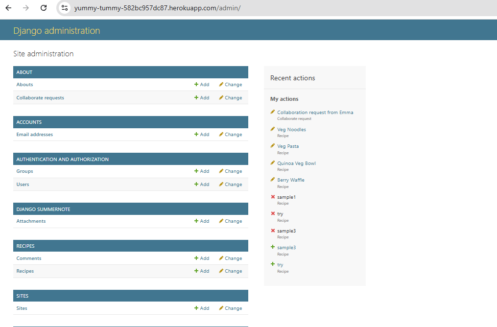

## Database
I used Code Institute's PostgreSQL database.

### Database planning
I used an Entity Relationship Diagram to plan my database.

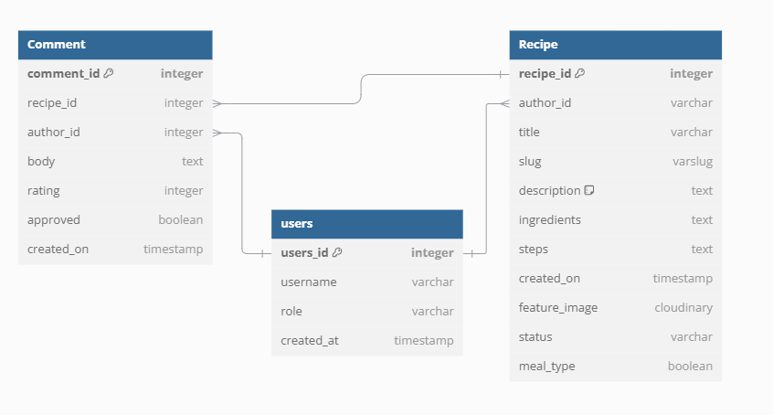

The database schema for Yummy Tummy was meticulously planned using an Entity Relationship Diagram (ERD). This diagram illustrates the relationships between different entities within the application, ensuring a well-structured and efficient database design.

The key entities and their relationships are as follows:

- **Users**: This entity stores user information, including authentication details. Each user can have multiple recipes and comments associated with their account.
- **Recipes**: This entity contains details about each recipe, such as the title, ingredients, instructions, and associated user. Recipes can have multiple comments and ratings.
- **Comments**: This entity stores user comments on recipes, including the content of the comment and the associated user and recipe.
- **Ratings**: This entity captures user ratings for recipes, linking each rating to a specific comment and recipe. This is actually a part of comment entity only, giving user the option to select one out of five options.

By organizing the database in this manner, Yummy Tummy ensures data integrity and supports efficient data retrieval, providing a seamless user experience.

### How to create a database

1. Navigate to [PostgreSQL](https://dbs.ci-dbs.net/) from Code Institute.
2. Enter your student email address in the input field provided.
3. Click Submit.
4. Wait while the database is created.
5. Check your email.
6. You now have a URL you can use to connect your app to your database.

## Additional Features

- **Home Page** 
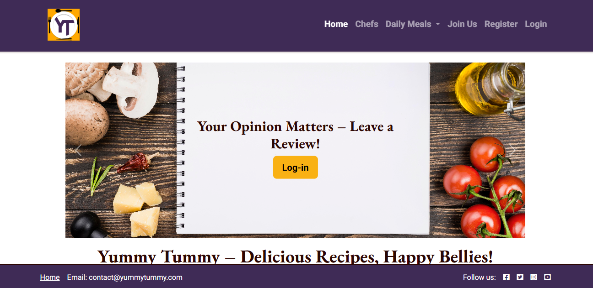

- **Chef Page**
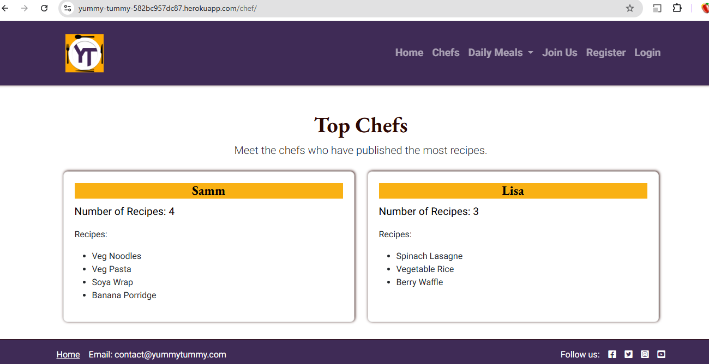

- **Dishes Page**
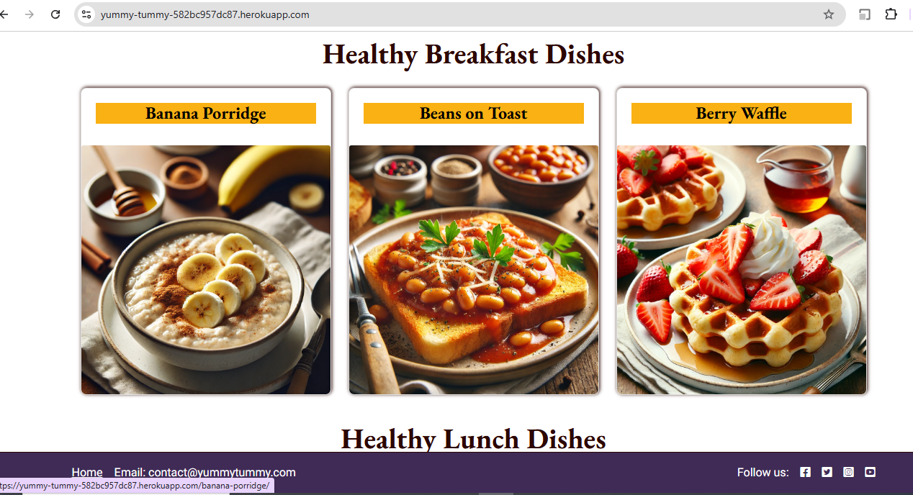

## Deployment
- The website was deployed to Heroku and can be found [here](https://yummy-tummy-582bc957dc87.herokuapp.com/)

### Heroku
- Heroku is a cloud platform that lets developers create, deploy, monitor and manage apps.
- You will need a Heroku log-in to be able to deploy a website to Heroku.
- Once you have logged into Heroku:

1. Click 'New' > 'Create new app'
2. Choose a unique name, choose your region and press 'Create app'
3. Click on 'Settings' and then 'Reveal Config Vars'
4. Add a key of 'DISABLE_COLLECTSTATIC' with a value of '1'.
5. Add a key of 'DATABASE_URL' - the value will be the URL you were emailed when creating your database.
6. Add a key of 'SECRET_KEY' - the value will be any random secret key (google 'secret key generator' and use it to generate a random string of numbers, letters and characters)
7. In your terminal, type the code you will need to install project requirements:
    - pip3 install gunicorn~=20.1
    - pip3 install -r requirements.txt
    - pip3 freeze --local > requirements.txt
8. Create an 'env.py' file at the root directory which contains the following:
    - import os
    - os.environ["DATABASE_URL"]='CI database URL'
    - os.environ["SECRET_KEY"]=" Your secret key"
9. Create a file at the root directory called Procfile. In this file enter: "web: gunicorn my_project.wsgi" (without the quotes)
10. In settings.py, set DEBUG to False. 
    - YOU SHOULD ALWAYS SET DEBUG TO FALSE BEFORE DEPLOYING FOR SECURITY
11. Add ",'.herokuapp.com' " (without the double quotes) to the ALLOWED_HOSTS list in settings.py
12. Add, commit and push your code.
13. Go back to Heroku, click on the 'Deploy' tab.
14. Connect your project to GitHub.
15. Scroll to the bottom and click 'Deploy Branch' and your project will be deployed!

## Testing
- Please see [TESTING.md](TESTING.md) file for all testing.

## AI Assistance in Development

During the development of Yummy Tummy, I strategically used GitHub Copilot to assist in various aspects of the code creation process. They were utilized to enhance productivity and code quality:

- **Code Suggestions**: Copilot helped in writing efficient and error-free code by suggesting relevant code snippets and functions. It also assisted in refining classes and optimizing the CSS for better organization.

- **Debugging**: I encountered several bugs in the code, which were identified and corrected with the help of AI. Copilot played crucial role to identify and fix issues and semantic errors quickly, ensuring a smooth development process.

- **Documentation**: AI tools facilitated the creation of comprehensive documentation by generating markdown templates and content suggestions for the website.

- **Design**: AI-based design tools provided inspiration and suggestions for UI/UX improvements, contributing to a more polished and user-friendly application.

- **Productivity**: Copilot significantly boosted productivity by automating repetitive tasks and providing intelligent code completions. This allowed me to focus more on the core functionality and design aspects of the application, ultimately leading to a more robust and feature-rich product.

**Reflection**: One of my proudest moments came when I used Copilot to refine the Bootstrap styling. I wasn’t very confident in front-end design, but the AI helped bridge that gap. It suggested small, impactful changes, like improving button alignment and tweaking breakpoints, that made the application feel polished and professional. These adjustments also ensured that the app was truly responsive, which was a priority for me.

#### Overall Impact:
Working with Copilot transformed my workflow. It allowed me to focus on higher-level decisions while handling repetitive tasks efficiently. However, it wasn’t always perfect—some suggestions required significant tweaking to fit my specific needs. Those moments were valuable reminders that the AI wasn’t a replacement for my skills but a tool to enhance them.

Looking back, I feel this experience not only improved my technical abilities but also my problem-solving skills. It pushed me to articulate my ideas clearly (both to the AI and myself) and made me more mindful of inclusivity and accessibility in software design. Above all, it taught me the importance of embracing new technologies as partners in the creative process.

## Frameworks, Libraries & Programs Used

**HTML5**: The standard markup language for creating web pages, providing the structure and content of the site.

**CSS3**: A style sheet language used for describing the presentation of a document written in HTML, enabling responsive and visually appealing designs.

**JavaScript**: A programming language that enables interactive web pages, enhancing user experience with dynamic content and features.

**GitHub**: A platform for version control and collaboration, allowing multiple developers to work on projects simultaneously and manage code changes.

**Heroku**: A cloud platform as a service (PaaS) supporting several programming languages, used for deploying, managing, and scaling web applications.

**Pexels**: A free stock photo and video website, providing high-quality images used within the application for visual enhancement.

**Cloudinary**: Media management service that allows uploading, storing, manipulating, and delivering images and videos.

**Crispy-bootstrap5**: Django package that integrates Django forms with Bootstrap 5, allowing for easy and consistent form rendering.

**Dj-database-url**: Utility for configuring database URLs in Django.

**Dj3-cloudinary-storage**: Django package that integrates Django media storage with the Cloudinary service.

**Django**: High-level web framework for Python that enables rapid and clean development of web applications.

   - **Django-summernote**: WYSIWYG editor based on Summernote for integration with Django.
  summernote==0.8.20.0
   - **Django-allauth**: Django application for authentication, registration, and account management.
  allauth==0.57.2
   - **Django-crispy-forms**: Django package that makes it easy to create elegant and reusable forms. crispy-forms==2.3

**Gunicorn**: WSGI HTTP server for Python applications, used to deploy Django applications.

**Pillow**: Image processing library for Python.

**Psycopg2**: PostgreSQL database adapter for Python.

**Python3-openid**: Library for supporting the OpenID protocol.

**Tzdata**: Time zone database.

**Whitenoise**: Library for serving static files in Django applications.

**Python**
   - asgiref==3.8.1
   - cloudinary==1.41.0
   - dj-database-url==0.5.0
   - gunicorn==20.1.0
   - oauthlib==3.2.2
   - psycopg==3.2.1
   - PyJWT==2.9.0
   - python3-openid==3.2.0
   - requests-oauthlib==2.0.0
   - sqlparse==0.5.1
   - urllib3==1.26.19
   - whitenoise==5.3.0

## Future Enhancements

There is significant potential for future enhancements in this project. Some of the possibilities include:

- **Recipe Video Tutorials**: Integrate video tutorials for recipes to provide a more interactive and engaging user experience.

- **Advanced Search Filters**: Implement advanced search filters allowing users to search recipes by ingredients, cooking time, and dietary preferences.

- **Meal Planner**: Add a meal planner feature to help users organize their weekly meals and generate shopping lists.

- **Social Sharing**: Enable social media sharing options so users can share their favorite recipes on platforms like Facebook, Instagram, and Twitter.

- **User Badges and Achievements**: Introduce a system of badges and achievements to reward active users and encourage more engagement.

- **Recipe Collections**: Allow users to create and share collections of their favorite recipes.

- **Nutritional Information**: Provide detailed nutritional information for each recipe to help users make informed dietary choices.

- **Multilingual Support**: Add support for multiple languages to cater to a broader audience.

- **Mobile App**: Develop a mobile application to provide a more convenient and accessible user experience on smartphones and tablets.

- **Integration with Grocery Delivery Services**: Partner with grocery delivery services to allow users to order ingredients directly from the app.

## Credits

### Resources

- **Coolors**: For generating the color palette used in the application.
- **Am I Responsive**: For testing the responsiveness of the application across different devices.
- **Google Fonts**: For providing the fonts used in the application.
- **Logo Design**: Created using Canva to reflect the essence of the application.
- **dbdiagram.io**: For creating the Entity Relationship Diagram (ERD) used in database planning.
- **Balsamiq**: For wireframe creation.
- **Heroku**: For hosting the application.
- **PostgreSQL**: For database management.
- **Unsplash & Chatgpt**: For providing high-quality images used in the application
- **Font Awesome**: For icons used throughout the site.
- **CI LMS**: For code related to sign-in, sign-out, register. I have used CI walkthrough project 'I think therefore I blog' for the support during the process. I customised the models, views and templates to create my own unique website.
- **Bootstrap**: HTML & CSS uses [Bootstrap Version 5.3](https://getbootstrap.com/docs/5.3/getting-started/introduction/)

### Inspiration

- **Recipe Websites**: Various recipe websites inspired the features and design of Yummy Tummy, aiming to create a user-friendly and engaging platform for food enthusiasts.
- **Community Feedback**: User feedback and suggestions played a crucial role in refining the application and adding valuable features.

### Tools

- **Visual Studio Code**: For code editing and development.
- **Git and GitHub**: For version control and repository management.

### Acknowledgements

- **Code Institute**: For providing the Full Stack Development Bootcamp course and resources that guided the development of this project.
- **Mentors and Tutors**: Special thanks to my faciliator **Emma Lamont** and tutors - **Spencer** and **Roo** for their invaluable guidance and support throughout the project.
- **Family and Friends**: For their encouragement and feedback, which helped shape the final product.
- **Open Source Community**: For the various libraries and frameworks that made this project possible, including Django, Bootstrap, and PostgreSQL.
- **GitHub Copilot**: For assisting in code suggestions, debugging, and documentation, significantly enhancing productivity and code quality.
- To everyone who tested the application and provided constructive feedback, helping to improve the overall user experience and functionality.

