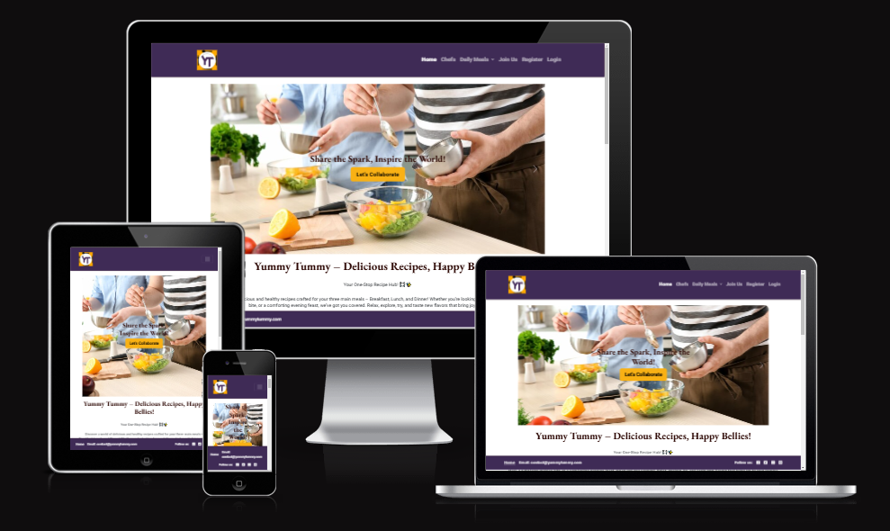

# YUMMY TUMMY

## Overview

Yummy Tummy is a delightful recipe suggestion application built with Django and styled using Bootstrap 5. It is my final project for Code Institute's 16-weeks Full Stack Development Bootcamp course. It offers a seamless user experience with full CRUD functionality, allowing users to effortlessly create, read, update, and delete their comments. 
This project aims to provide a centralized, user-friendly platform for food enthusiasts to discover and manage recipes, enhancing culinary exploration and enjoyment.

We addresses the challenge of meal planning by offering users the option to categorize recipes by meal type (breakfast, lunch, dinner). This feature helps users to relax and plan their meals accordingly, ensuring a well-organized and enjoyable cooking experience.

[Live View](https://yummy-tummy-582bc957dc87.herokuapp.com/)

## Responsive
Yummy Tummy is fully responsive, ensuring a seamless experience across various devices, including desktops, tablets, and mobile phones. 
The design adapts to different screen sizes, providing an optimal viewing experience whether you're at home or on the go.

## User Expereince (UX)

Throughout the development of Yummy Tummy, **Agile methodology** was employed to ensure iterative progress and continuous improvement. 
This approach facilitated regular feedback and allowed for adaptive planning, ultimately leading to a more refined and user-centric application.

### User Goals

Users want a platform that:
- Provides a wide variety of recipes to explore.
- Allows easy categorization and search of recipes by meal types
- Includes user reviews and ratings to help in selecting recipes.
- Easy navigation

### Site Owner Goals

The site owner aims to:
- Create a comprehensive and user-friendly recipe management platform.
- Encourage user engagement through interactive features like comments and ratings.
- Continuously update the recipe database with new and diverse recipes.
- Foster a community of food enthusiasts who can collaborate by sharing new recipes.
- Maintain a high standard of UX/UI design to enhance user satisfaction.

### Link to User Stories in GitHub Projects:

I have used the MoSCoW technique to prioritize and complete my project requirements effectively. This technique helped me to categorize the features into Must-Have, Should-Have, and Could-Have, ensuring that the most critical functionalities were implemented first, while also considering additional enhancements for future development.

Here is the link to my [Project Board](https://github.com/users/SonaliP11/projects/8)

#### MoSCoW Tecnhique
The MoSCoW technique is a prioritization method used to decide which features to implement in a project. It stands for:

- **Must-Have**: These are the essential features that the project cannot do without. They are critical for the application's functionality and must be included in the initial release.
- **Should-Have**: These features are important but not critical. They add significant value to the project and should be included if possible, but the project can still function without them.
- **Could-Have**: These are desirable features that can enhance the user experience but are not essential. They can be considered for future updates if time and resources permit.
- **Won't-Have**: These features are the least critical and will not be included in the current project scope. They may be revisited in future iterations.

By using the MoSCoW technique, I was able to focus on delivering the most critical features first, ensuring a functional and valuable application for users while planning for future enhancements.
I have implemented all Must-have and Should-have features. Could-have are for future implementations.

## Design

### Wireframes

The wireframes for Yummy Tummy were created using Balsamiq to create clear, visual layouts of the site's design. While the initial designs provided a solid foundation, some elements evolved during development to enhance the overall user experience. These changes, though different from the original wireframes, resulted in a more polished and user-friendly application.

- [Click here for desktop wireframe](static/images/readme/wireframe-desktop.png)
- [Click here for tablet wireframe](static/images/readme/wireframe-tablet.png)
- [Click here for mobile wireframe](static/images/readme/wireframe-mobile.png)

### Logo
The logo for Yummy Tummy was created by me, reflecting the essence of the application. Here are some key points about the logo:

- **Design Concept**: The logo combines elements of cutlery to visually represent the application's focus on recipes and cooking.
- **Color Scheme**: The colors used in the logo align with the overall color palette of the application, ensuring a cohesive visual identity.
- **Typography**: The font used in the logo is clean and modern, making it easily readable and visually appealing.
- **Scalability**: The logo is designed to be scalable, ensuring it looks great on various devices and screen sizes, from mobile phones to desktops.

- [logo](static/images/readme/logo.jpeg)

### Color Palette

- #3F2B56 - Navigation and footer background
- #F9B114 - Background of Buttons and card-title
- #2C0703 - Heading text and box-shadow
- #F5F2F2 - Forms background
- #000000 - Text color

### Typography 

 - Heading - 'EB Garamond', serif
 - Body - 'Roboto', serif

## Features

### Authentication

- **Sign-In**: Users can sign in to their accounts to access personalized features such as adding ratings and reviews.

- **Sign-In Success** : Once log-in, user will see success message.
 

- **Register**: New users can register for an account to start collaborating and sharing their recipes.

- **Sign-out** : In the header, if you are logged in, you can press the 'Logout' button which will take you to the sign-out page.
 

### Collaboration

- **Share Recipes**: Users can share their own recipes with the community, fostering a collaborative environment. 

- **Write Reviews**: Users can write reviews and rate recipes, helping others to choose the best recipes.

- **Awaiting approval**: Users will receive apporoval awaiting text after editing their own comment.

- **Comment Approved**: Admin will approve comment from dashboard.

- **Comment Updated**: Users will be able to see their comments updated.

### Admin panel Database

The database for Yummy Tummy is designed to efficiently manage and store user data, recipes, comments, and ratings. It uses PostgreSQL, a powerful, open-source relational database system, which ensures data integrity and supports complex queries.

## Database
I used Code Institute's PostgreSQL database.

### Database planning
I used an Entity Relationship Diagram to plan my database.

The database schema for Yummy Tummy was meticulously planned using an Entity Relationship Diagram (ERD). This diagram illustrates the relationships between different entities within the application, ensuring a well-structured and efficient database design.

The key entities and their relationships are as follows:

- **Users**: This entity stores user information, including authentication details. Each user can have multiple recipes and comments associated with their account.
- **Recipes**: This entity contains details about each recipe, such as the title, ingredients, instructions, and associated user. Recipes can have multiple comments and ratings.
- **Comments**: This entity stores user comments on recipes, including the content of the comment and the associated user and recipe.
- **Ratings**: This entity captures user ratings for recipes, linking each rating to a specific comment and recipe. This is actually a part of comment entity only, giving user the option to select one out of five options.

By organizing the database in this manner, Yummy Tummy ensures data integrity and supports efficient data retrieval, providing a seamless user experience.

### How to create a database

1. Navigate to [PostgreSQL](https://dbs.ci-dbs.net/) from Code Institute.
2. Enter your student email address in the input field provided.
3. Click Submit.
4. Wait while the database is created.
5. Check your email.
6. You now have a URL you can use to connect your app to your database.

## Deployment
- The website was deployed to Heroku and can be found [here](https://yummy-tummy-582bc957dc87.herokuapp.com/)

### Heroku
- Heroku is a cloud platform that lets developers create, deploy, monitor and manage apps.
- You will need a Heroku log-in to be able to deploy a website to Heroku.
- Once you have logged into Heroku:

1. Click 'New' > 'Create new app'
2. Choose a unique name, choose your region and press 'Create app'
3. Click on 'Settings' and then 'Reveal Config Vars'
4. Add a key of 'DISABLE_COLLECTSTATIC' with a value of '1'.
5. Add a key of 'DATABASE_URL' - the value will be the URL you were emailed when creating your database.
6. Add a key of 'SECRET_KEY' - the value will be any random secret key (google 'secret key generator' and use it to generate a random string of numbers, letters and characters)
7. In your terminal, type the code you will need to install project requirements:
    - pip3 install gunicorn~=20.1
    - pip3 install -r requirements.txt
    - pip3 freeze --local > requirements.txt
8. Create an 'env.py' file at the root directory which contains the following:
    - import os
    - os.environ["DATABASE_URL"]='CI database URL'
    - os.environ["SECRET_KEY"]=" Your secret key"
9. Create a file at the root directory called Procfile. In this file enter: "web: gunicorn my_project.wsgi" (without the quotes)
10. In settings.py, set DEBUG to False. 
    - YOU SHOULD ALWAYS SET DEBUG TO FALSE BEFORE DEPLOYING FOR SECURITY
11. Add ",'.herokuapp.com' " (without the double quotes) to the ALLOWED_HOSTS list in settings.py
12. Add, commit and push your code.
13. Go back to Heroku, click on the 'Deploy' tab.
14. Connect your project to GitHub.
15. Scroll to the bottom and click 'Deploy Branch' and your project will be deployed!

## Technologies used

- HTML was used to structure the content of the website.
- CSS were used to design the layout of the website.
- Bootstrap was used as a CSS framework to provide a grid structure and improve responsiveness.
- Python and Django were used to build the backend review framework.
- GitHub was used to host the repository and version control.
- Heroku was the hosting platform.

## Testing
- Please see [TESTING.md](TESTING.md) file for all testing.

