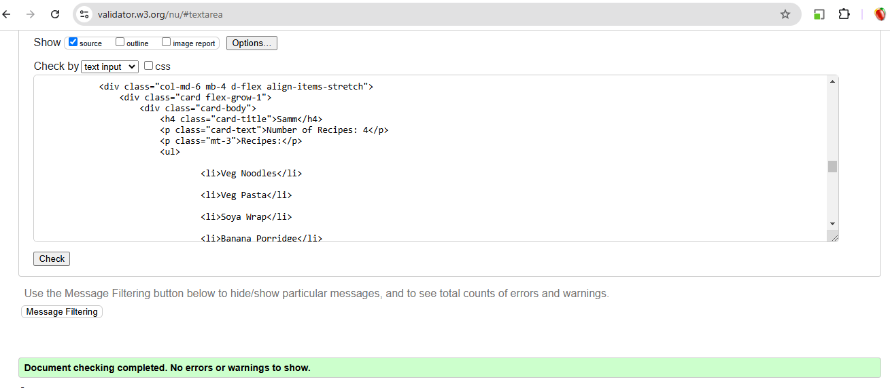
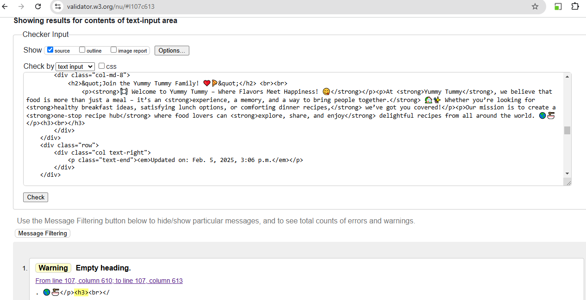
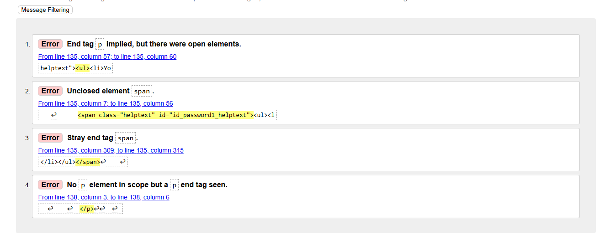
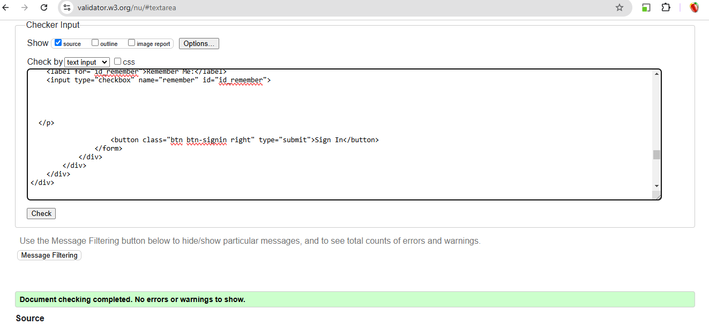
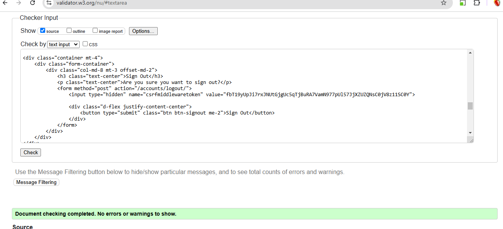
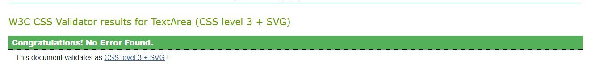

# Testing

- Manual testing was carried out throughout the development of the website and bugs fixed as they arose. 

## Manual testing
- Manual testing was carried out on the local and deployed sites.

## Code validators

### HTML Validator
- The [W3C Validator](https://validator.w3.org/) was used to validate the HTML.

#### Home
- 

#### Chef Page
- 

#### Join Us 
- 

#### Register 
- 

-When I checked the code that the validator was referring to, it was the code which was integrated by Django for the review functionality and not written by me. I looked for it everywhere in an attempt to fix it but could not find it.

#### Sign-In
- 

#### Sign-out
- 

### CSS Validator
- The [W3C CSS Validator](https://jigsaw.w3.org/css-validator/) was used to validate the CSS.
- 

