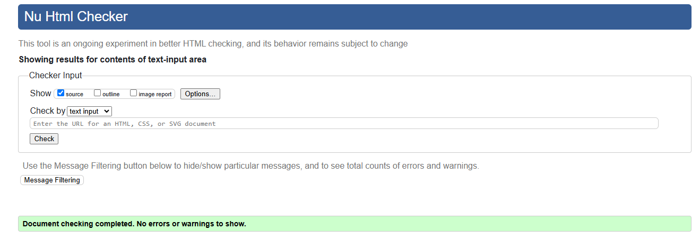

# Testing

## Manual testing

- Manual testing was carried out on the local and deployed sites. It was carried out throughout the development of the website and bugs were fixed as they arose. 

| Location           | Feature                 | Expected Outcome                                                                                                                                                                                                                                          | Pass/Fail | Notes                                                                                                                                      |
| ------------------ | ----------------------- | --------------------------------------------------------------------------------------------------------------------------------------------------------------------------------------------------------------------------------------------------------- | --------- | ------------------------------------------------------------------------------------------------------------------------------------------ |
| Header             | Home button             | Takes user to home page on click                                                                                                                                                                                                                          | PASS      |                                                                                                                                            |
| Header             | Log-in button           | Takes user to log-in page on click                                                                                                                                                                                                                        | PASS      | If user is not logged in, the register and log-in buttons will be displayed but if they are logged in, only the log-out button will appear |
| Header             | Register button         | Takes user to registration page on click                                                                                                                                                                                                                  | PASS      |
| Header             | Logout button           | Takes user to log-out page on click                                                                                                                                                                                                                       | PASS      |
| Header             | Chef button           | Takes user to chef page on click                                                                                                                                                                                                                       | PASS      |
| Header             | Daily Meals button           | Allows user to select one option out of three on click                                                                                                                                                                                                                       | PASS      |
| Header             | Join Us button           | Takes user to Join-us, Collaborate page on click                                                                                                                                                                                                                       | PASS      |
| Log-in page        | Log-in function         | When user enters an unknown username, the user will not be logged in                                                                                                                                                                                      | PASS      |                                                                                                                                            |
| Log-in page        | Log-in function         | When user enters an unknown password, the user will not be logged in                                                                                                                                                                                      | PASS      |                                                                                                                                            |
| Log-in page        | Log-in function         | When user enters a known username AND password, the user will be logged in                                                                                                                                                                                | PASS      |                                                                                                                                            |
| Register page      | Register function       | If user does not enter information into any of the fields, they will be prompted to fill in the field                                                                                                                                                     | PASS      |                                                                                                                                            |
| Register page      | Register function       | If user does not enter a password which fits the criteria, will not be registered                                                                                                                                                                         | PASS      |                                                                                                                                            |
| Register page      | Register function       | If user does not enter a matching password into the password (again) box, they will not be registered                                                                                                                                                     | PASS      |                                                                                                                                            |
| Register page      | Register function       | If user enters appropriate details, they will be registered                                                                                                                                                                                               | PASS      |                                                                                                                                            |
| Logout page        | Sign out button         | Signs user out on click                                                                                                                                                                                                                                   | PASS      |                                                                                                
| Home page          | Recipe detail card       | Click on any recipe, it will take to its detail page                                                                                                                                                                                                      | PASS      |                                                                                                                                            |
| Footer             | Home                | Clicking will take you to the 'Home' page                                                                                                                                                                | PASS      |                                                                                                                                            |
| Footer             | Facebook icon           | Clicking will take you to the 'Facebook' page                                                                                                                                                                                                                | PASS      |                                                                                                                                            |
| Footer             | Instagram icon                | Clicking will take you to the 'Instagram' page                                                                                                                                                                                             | PASS      |                                                                                                                                            |
| Footer             | Twitter icon                | Clicking will take you to the 'Twitter' page                                                                                                                                                                                             | PASS      |                                                                                                
| Footer             | Youtube icon                | Clicking will take you to the 'Youtube' page                                                                                                                                                                                             | PASS      |                                                                                                
| Recipe review/Comment      | Leave a review function | Filling out the 'Comment' box and pressing Submit will submit the review for approval                                                                                                                                                                                                  | PASS      |                                                                                                                                            |
| Recipe review       | Delete a review         | Pressing 'Delete' will delete the user review                                                                                                                                                                                                             | PASS      |                                                                                                                                            |
| Recipe review       | Edit a review           | Pressing 'Edit' will copy the old review in 'Add Comment' box and allowing the user to edit                                                                                                                                                                                        | PASS      |                                                                                                                                            |
| Recipe Rating | Add rating           | Selecting rating stars will update the review                                                                                                                                                                            | PASS      |                                                                                                                                            |

## Code validators

### HTML Validator
- The [W3C Validator](https://validator.w3.org/) was used to validate the HTML.

#### Home

#### Chef Page

#### Join Us 

#### Register 

-When I checked the code that the validator was referring to, it was the code which was integrated by Django for the review functionality and not written by me. I looked for it everywhere in an attempt to fix it but could not find it.

#### Sign-In

#### Sign-out

### CSS Validator
- The [W3C CSS Validator](https://jigsaw.w3.org/css-validator/) was used to validate the CSS.

### JS Validator
- The [JShint](https://jshint.com/) was used to validate the comments.js file.

### Python
- The [CI Python Linter](https://pep8ci.herokuapp.com/) was used to validate the Python files.

#### "About" app files
All files were edited according to the suggestions provided by the validator and are now showing no errors.

##### admin.py

##### apps.py

##### forms.py

##### models.py

##### urls.py

##### views.py

#### "Recipe" app files
All files were edited according to the suggestions provided by the validator and are now showing no errors.

##### admin.py

##### apps.py

##### forms.py

##### models.py

##### urls.py

##### views.py

#### Settings.py

-Even though some lines were considered too long by PEP8 (highlighted), I decided that the readability of the code was better when left on the same line, since it was very close to the accepted limit. Even though error exists, the app still functions. 

#### Project urls

## Lighthouse

- The home and detail pages scored low in the best practices. This seemed to be due to the Cloudinary files not producing HTTPS files. Efforts are being made to address this issue to improve the overall score but this is something to be considered as future improvement.

### Desktop Lighthouse

#### Home page

#### Chef page

#### Detail page

#### Join us page

#### Register

#### Sign-in page

### Mobile Lighthouse

#### Home page

#### Chef page

#### Detail page

#### Join us page

## Browsers
- I use Google Chrome as my browser so all screenshots above are from Google Chrome.

- The site was tested on Microsoft Edge.
- 
